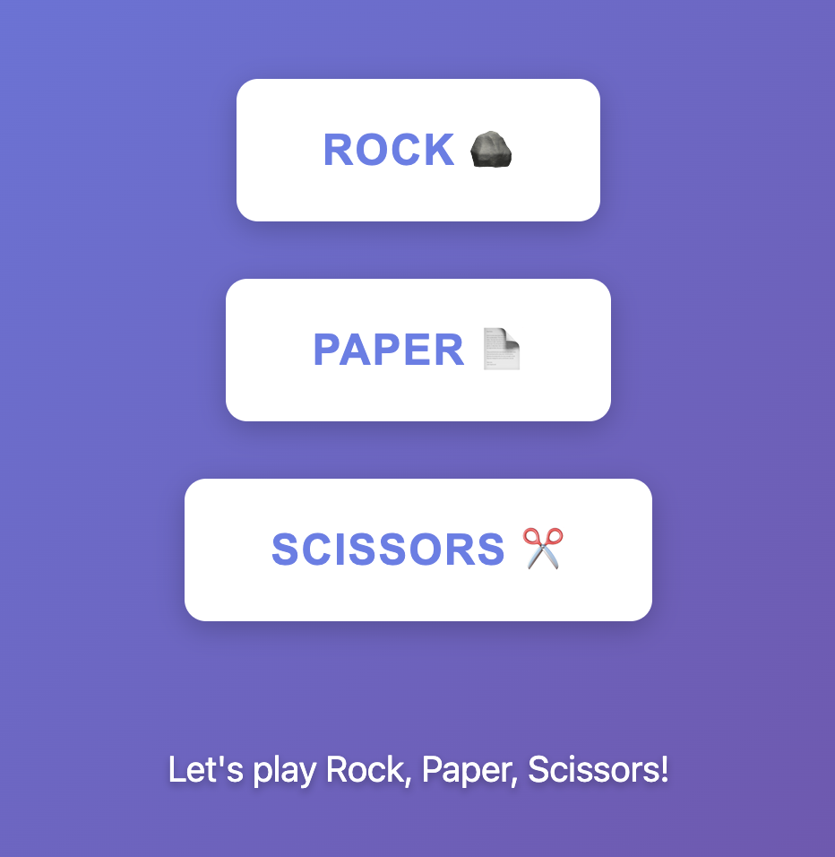
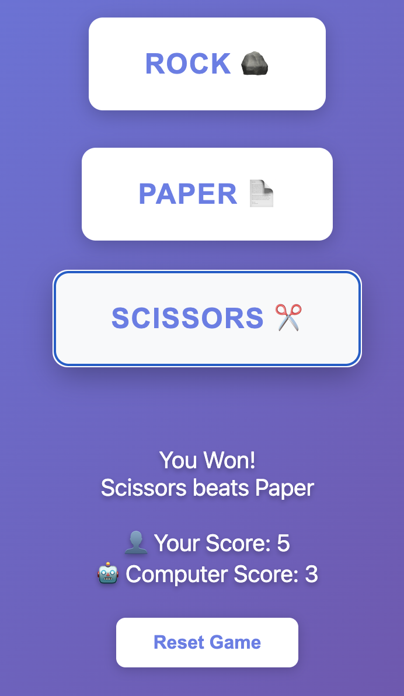

# Rock Paper Scissors

## Screenshot

    

    

The game features:
- Three interactive buttons at the top (Rock, Paper, Scissors)
- A centered result display with a glass effect
- Score tracking for both player and computer
- Smooth hover effects and transitions

## Browser Support

Works on all modern browsers including:
- Chrome
- Firefox
- Safari
- Edge

## License

Free to use for personal and educational purposes.

## Author
Kevin Thomas

Created as a fun JavaScript project to practice DOM manipulation and CSS animations.
---

Enjoy the game! 🎮